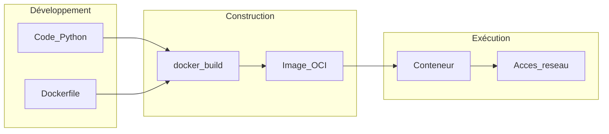

# Cahier des charges — Application Python conteneurisée (Docker)

| Document | Version | Date |
|----------|---------|------|
| Cahier des charges | 1.0 | [À compléter : date] |

**Référence projet :** [À compléter : nom du produit ou du projet]

---

## 1. Introduction

### 1.1 Objet du document

Le présent cahier des charges définit le contexte, les objectifs, le périmètre, les exigences fonctionnelles et non fonctionnelles, ainsi que les contraintes techniques pour la réalisation et la mise en exploitation d’une **application Python** livrée sous forme d’**image Docker** et exécutée en **conteneur**.

Il sert de référence commune entre la maîtrise d’ouvrage, la maîtrise d’œuvre et les équipes d’exploitation pour valider les livrables et les critères d’acceptation.

### 1.2 Glossaire

| Terme | Définition |
|-------|------------|
| **Image Docker** | Empilement en lecture seule des couches système, dépendances et application, utilisé pour instancier un conteneur. |
| **Conteneur** | Instance exécutable d’une image, isolée du système hôte (processus, réseau, système de fichiers selon la configuration). |
| **Dockerfile** | Fichier de recette décrivant les étapes de construction de l’image. |
| **CI (intégration continue)** | Chaîne automatisée de build, tests et publication d’artefacts (images, packages). |
| **MOA** | Maîtrise d’ouvrage — porteur du besoin métier. |
| **MOE** | Maîtrise d’œuvre — réalisation technique. |

---

## 2. Contexte et objectifs

### 2.1 Contexte

[À compléter : décrire le contexte métier ou technique — problème à résoudre, existant à remplacer ou à compléter, utilisateurs cibles.]

### 2.2 Objectifs mesurables

| ID | Objectif | Indicateur cible |
|----|----------|------------------|
| O-01 | [À compléter] | [À compléter : ex. délai de réponse, taux de succès] |
| O-02 | Déployer l’application de façon reproductible via conteneur | Build et run documentés et reproductibles sur environnement cible |
| O-03 | [À compléter] | [À compléter] |

### 2.3 Parties prenantes

| Rôle | Organisation / personne | Responsabilité |
|------|-------------------------|----------------|
| MOA | [À compléter] | Expression et validation du besoin |
| MOE | [À compléter] | Conception, développement, tests |
| Exploitant | [À compléter] | Hébergement, supervision, sauvegardes |

---

## 3. Périmètre

### 3.1 Inclus

- Développement de l’application en **Python** selon les besoins fonctionnels décrits en section 4.
- Fourniture d’un **Dockerfile** permettant de construire une image exécutable.
- Optionnel : fichier **Docker Compose** pour orchestrer le service applicatif (et dépendances locales type base de données si retenu).
- Documentation minimale d’installation et d’exécution (voir section 8).
- Jeux de tests et critères d’acceptation associés (section 9).

### 3.2 Exclus (sauf mention contraire explicite)

- [À compléter : ex. développement d’applications mobiles, intégration ERP spécifique, formation utilisateurs étendue.]
- Hébergement production, nom de domaine, certificats TLS — sauf si ajoutés au périmètre par avenant.
- Maintenance corrective au-delà de la période de garantie définie contractuellement — [À compléter : durée].

---

## 4. Besoins fonctionnels

Les exigences ci-dessous sont numérotées pour le suivi de recette. Les formulations génériques doivent être précisées lors de l’affinage métier.

| ID | Description | Priorité |
|----|-------------|----------|
| RF-01 | L’application expose une **API HTTP** (REST ou équivalent) pour [À compléter : ressources / opérations]. | [Majeur / Souhaitable] |
| RF-02 | L’application propose une **interface en ligne de commande (CLI)** pour [À compléter : tâches]. | [Majeur / Souhaitable / Hors périmètre] |
| RF-03 | L’application exécute des **traitements batch** ou planifiés pour [À compléter]. | [À compléter] |
| RF-04 | L’application fournit une **interface web** pour [À compléter]. | [À compléter] |
| RF-05 | [À compléter : user story ou exigence supplémentaire] | [À compléter] |

**User stories (exemples à adapter) :**

- En tant qu’**utilisateur API**, je veux [À compléter] afin de [À compléter].
- En tant qu’**administrateur**, je veux configurer l’application via variables d’environnement afin de l’adapter à chaque environnement sans reconstruire l’image pour les secrets injectés au runtime.

---

## 5. Besoins non fonctionnels

| ID | Domaine | Exigence |
|----|---------|----------|
| RNF-01 | Disponibilité | [À compléter : ex. objectif 99 % mensuel, fenêtres de maintenance] |
| RNF-02 | Performances | [À compléter : ex. latence p95, débit, taille max des requêtes] |
| RNF-03 | Sécurité | Secrets fournis au runtime (variables d’environnement, secrets orchestrateur) — **aucun secret en clair dans l’image** sauf justification documentée. |
| RNF-04 | Sécurité | L’utilisateur par défaut dans le conteneur n’est **pas** `root` lorsque c’est compatible avec les besoins d’écriture sur le système de fichiers. |
| RNF-05 | Observabilité | Logs sur **stdout** / **stderr** ; format et niveau de détail [À compléter : ex. JSON structuré, niveau INFO en prod]. |
| RNF-06 | Traçabilité | [À compléter : identifiants de corrélation, audit des actions sensibles] |
| RNF-07 | Conformité | [À compléter : RGPD, secteur réglementé, etc. ou « non applicable »] |

---

## 6. Contraintes techniques

| Élément | Spécification |
|---------|----------------|
| Langage | Python [À compléter : ex. 3.12] |
| Dépendances | Fichier `requirements.txt`, `pyproject.toml` / Poetry, ou équivalent — à figer pour la reproductibilité des builds |
| Docker | `Dockerfile` versionné ; option **multi-stage** pour réduire la taille de l’image finale |
| Orchestration locale | `docker-compose.yml` optionnel pour dev et/ou déploiement simplifié |
| Configuration | Variables d’environnement documentées ; valeurs par défaut sûres pour le développement |
| Ports | [À compléter : ex. 8000 pour HTTP] — documentés dans le README |
| Registre d’images | [À compléter : Docker Hub, registre privé, GHCR, etc.] |

---

## 7. Architecture cible (schéma)

Vue logique du cycle développement → image → exécution. Le framework web ou la bibliothèque applicative reste à choisir selon les RF.

---

## 8. Livrables

| Livrable | Description |
|----------|-------------|
| Code source | Application Python conforme aux sections 4 à 6 |
| `Dockerfile` | Build reproductible de l’image |
| `docker-compose.yml` | Si retenu — services, volumes, réseaux, variables |
| Dépendances | Fichier(s) de figeage des versions |
| Tests | Tests unitaires et/ou d’intégration selon le périmètre convenu |
| Documentation | `README.md` : prérequis, build, run, variables d’environnement, healthcheck |
| [À compléter] | [Autres livrables contractuels] |

---

## 9. Critères d’acceptation

Les critères suivants sont vérifiables lors de la recette.

| ID | Critère | Méthode de vérification |
|----|---------|-------------------------|
| CA-01 | `docker build` s’exécute **sans erreur** sur une machine de référence [À compléter : OS, version Docker] | Exécution manuelle ou pipeline CI |
| CA-02 | Le conteneur **démarre** avec la commande documentée | `docker run` ou `docker compose up` |
| CA-03 | **Healthcheck** (Dockerfile ou orchestrateur) renvoie un état sain lorsque l’application est prête | Inspection `docker inspect` ou équivalent |
| CA-04 | Les **tests automatisés** passent | Commande documentée (ex. `pytest`) |
| CA-05 | Les endpoints ou fonctionnalités **RF majeurs** répondent selon les cas de test agréés | Jeu de tests de recette [À compléter] |
| CA-06 | Aucun secret obligatoire **figé** dans l’image pour la production | Revue du Dockerfile et des layers |

---

## 10. Planning et jalons

| Jalon | Description | Date cible |
|-------|-------------|------------|
| J1 | Validation du présent cahier des charges | [À compléter] |
| J2 | Fin développement / feature freeze | [À compléter] |
| J3 | Recette fonctionnelle et technique | [À compléter] |
| J4 | Mise en production ou livraison finale | [À compléter] |

---

## 11. Risques et dépendances

| Risque / dépendance | Impact | Mitigation |
|---------------------|--------|------------|
| Évolution des versions Python ou des dépendances | Régressions, failles de sécurité | Verrouillage des versions ; mises à jour planifiées |
| Version minimale de Docker sur l’hôte | Échec du build ou du run | Documenter la version supportée ; tester sur CI |
| Dépendances tierces indisponibles | Build ou runtime impossible | Miroirs, cache, alternatives documentées |
| Accès au registre d’images | Impossibilité de pousser/tirer l’image | Comptes, secrets CI, politique réseau |
| [À compléter] | [À compléter] | [À compléter] |

---

## 12. Historique des versions du document

| Version | Date | Auteur | Résumé des changements |
|---------|------|--------|------------------------|
| 1.0 | [À compléter] | [À compléter] | Version initiale |

---

*Fin du cahier des charges.*
