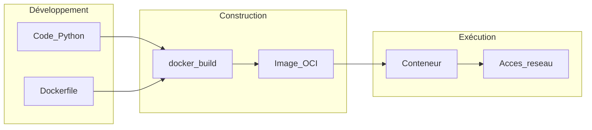
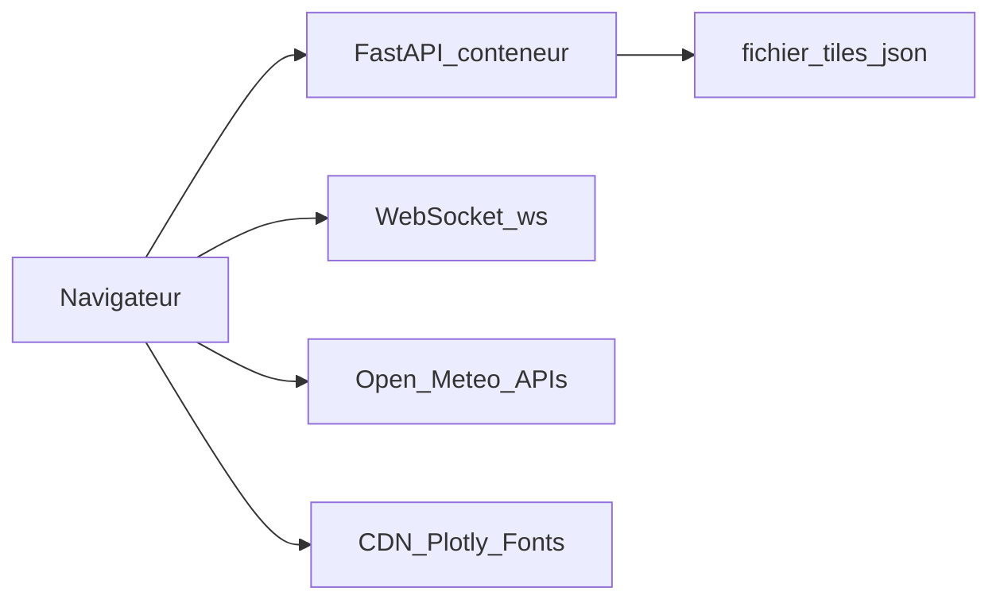

# Cahier des charges — Application Python conteneurisée (Docker)

| Document | Version | Date |
|----------|---------|------|
| Cahier des charges | 1.1 | mars 2026 |

**Référence projet :** application web **Horloge & météo** — horloge multi-fuseaux (persistée) et visualisation d’historique de température (Open-Meteo, graphique Plotly.js côté client).

---

## 1. Introduction

### 1.1 Objet du document

Le présent cahier des charges définit le contexte, les objectifs, le périmètre, les exigences fonctionnelles et non fonctionnelles, ainsi que les contraintes techniques pour la réalisation et la mise en exploitation d’une **application Python** livrée sous forme d’**image Docker** et exécutée en **conteneur**.

Il sert de référence commune entre la maîtrise d’ouvrage, la maîtrise d’œuvre et les équipes d’exploitation pour valider les livrables et les critères d’acceptation.

### 1.2 Glossaire

| Terme | Définition |
|-------|------------|
| **Image Docker** | Empilement en lecture seule des couches système, dépendances et application, utilisé pour instancier un conteneur. |
| **Conteneur** | Instance exécutable d’une image, isolée du système hôte (processus, réseau, système de fichiers selon la configuration). |
| **Dockerfile** | Fichier de recette décrivant les étapes de construction de l’image. |
| **CI (intégration continue)** | Chaîne automatisée de build, tests et publication d’artefacts (images, packages). |
| **MOA** | Maîtrise d’ouvrage — porteur du besoin métier. |
| **MOE** | Maîtrise d’œuvre — réalisation technique. |

---

## 2. Contexte et objectifs

### 2.1 Contexte

Application de démonstration / outil léger : consultation simultanée de l’heure dans plusieurs fuseaux horaires, avec persistance locale des tuiles, et consultation optionnelle d’un historique de température pour un lieu géocodé. Livraison **conteneurisée** pour installation reproductible.

### 2.2 Objectifs mesurables

| ID | Objectif | Indicateur cible |
|----|----------|------------------|
| O-01 | Fournir une interface web fonctionnelle (horloge + température) | Parcours utilisateur documenté dans le README ; APIs et WebSocket opérationnels |
| O-02 | Déployer l’application de façon reproductible via conteneur | Build et run documentés et reproductibles sur environnement cible |
| O-03 | Traçabilité des versions (app, stack, composants front) | Endpoint `/api/about` et dialogue « À propos » à jour |

### 2.3 Parties prenantes

| Rôle | Organisation / personne | Responsabilité |
|------|-------------------------|----------------|
| MOA | [À compléter] | Expression et validation du besoin |
| MOE | [À compléter] | Conception, développement, tests |
| Exploitant | [À compléter] | Hébergement, supervision, sauvegardes |

---

## 3. Périmètre

### 3.1 Inclus

- Développement de l’application en **Python** selon les besoins fonctionnels décrits en section 4.
- Fourniture d’un **Dockerfile** permettant de construire une image exécutable.
- Optionnel : fichier **Docker Compose** pour orchestrer le service applicatif (et dépendances locales type base de données si retenu).
- Documentation minimale d’installation et d’exécution (voir section 8).
- Jeux de tests et critères d’acceptation associés (section 9).

### 3.2 Exclus (sauf mention contraire explicite)

- [À compléter : ex. développement d’applications mobiles, intégration ERP spécifique, formation utilisateurs étendue.]
- Hébergement production, nom de domaine, certificats TLS — sauf si ajoutés au périmètre par avenant.
- Maintenance corrective au-delà de la période de garantie définie contractuellement — [À compléter : durée].

---

## 4. Besoins fonctionnels

Les exigences ci-dessous sont numérotées pour le suivi de recette. Les formulations génériques doivent être précisées lors de l’affinage métier.

| ID | Description | Priorité |
|----|-------------|----------|
| RF-01 | L’application expose une **API HTTP** (REST) pour la version, les métadonnées « à propos », la liste / création / suppression / ordre des tuiles fuseaux, la recherche de fuseaux IANA, l’état partagé du formulaire température (`/api/meteo/ui`) et la route active partagée (`/api/nav`). | Majeur |
| RF-02 | L’application expose un **WebSocket** `/ws` pour pousser l’heure, les mises à jour de tuiles, l’état météo UI et la navigation synchronisée entre clients. | Majeur |
| RF-03 | **Hors périmètre** actuel : CLI dédiée et traitements batch planifiés (l’app est un service web continu). | Hors périmètre |
| RF-04 | **Interface web** en **deux pages** : **`/` — Horloge** (tuiles par fuseau, ajout/suppression, glisser-déposer pour l’ordre) et **`/meteo` — Température** (lieu par géocodage Open-Meteo, plage de dates, résolution horaire ou journalière, graphique Plotly.js avec zoom). Navigation par liens dans l’en-tête. | Majeur |
| RF-05 | Persistance des tuiles horloge dans un fichier JSON sous `DATA_DIR` (ex. volume Docker). | Majeur |
| RF-06 | **Synchronisation multi-utilisateurs** (même instance serveur) : tuiles et ordre partagés ; formulaire température et page affichée (`/` ou `/meteo`) partagés avec persistance JSON et notification WebSocket ; politique de conflit **dernier écriture gagne** sur les mises à jour concurrentes. | Majeur |

**User stories (référence recette) :**

- En tant qu’**utilisateur**, je veux voir l’heure de plusieurs villes/fuseaux et les réorganiser afin de suivre des collaborateurs ou des marchés dans le monde.
- En tant qu’**utilisateur**, je veux afficher un historique de température pour un lieu sur une plage de dates afin de comparer des périodes (données via Open-Meteo depuis le navigateur).
- En tant qu’**exploitant**, je veux configurer port, TLS et répertoire de données via variables d’environnement afin d’adapter l’instance sans modifier le code.

---

## 5. Besoins non fonctionnels

| ID | Domaine | Exigence |
|----|---------|----------|
| RNF-01 | Disponibilité | [À compléter : ex. objectif 99 % mensuel, fenêtres de maintenance] |
| RNF-02 | Performances | Service léger ; latence principale liée au réseau pour l’onglet Température (APIs externes). Pas d’objectif chiffré imposé dans ce document. |
| RNF-03 | Sécurité | Secrets fournis au runtime (variables d’environnement, secrets orchestrateur) — **aucun secret en clair dans l’image** sauf justification documentée. |
| RNF-04 | Sécurité | L’utilisateur par défaut dans le conteneur n’est **pas** `root` lorsque c’est compatible avec les besoins d’écriture sur le système de fichiers. |
| RNF-05 | Observabilité | Logs sur **stdout** / **stderr** ; format et niveau de détail [À compléter : ex. JSON structuré, niveau INFO en prod]. |
| RNF-06 | Traçabilité | [À compléter : identifiants de corrélation, audit des actions sensibles] |
| RNF-07 | Conformité | [À compléter : RGPD, secteur réglementé, etc. ou « non applicable »] |

---

## 6. Contraintes techniques

| Élément | Spécification |
|---------|----------------|
| Langage | Python **3.12** (image de base `python:3.12-slim`) |
| Framework | **FastAPI** + **Uvicorn** ; pages statiques `app/static/clock.html` (`/`) et `app/static/meteo.html` (`/meteo`), CSS `app/static/app.css` |
| Dépendances | `requirements.txt` figé pour la reproductibilité des builds |
| Docker | `Dockerfile` versionné ; utilisateur non-root `appuser` ; entrée `docker-entrypoint.sh` |
| Orchestration locale | `docker-compose.yml` — service HTTP (8000), profil optionnel HTTPS (8443) |
| Configuration | Variables d’environnement documentées dans le README (`DATA_DIR`, `APP_VERSION`, TLS, port) |
| Ports | **8000** (HTTP), **8443** (HTTPS via compose profil) — documentés dans le README |
| Registre d’images | [À compléter selon organisation : Docker Hub, GHCR, registre privé, etc.] |

---

## 7. Architecture cible (schéma)

Vue logique du cycle développement → image → exécution. Le navigateur peut appeler des **APIs publiques** pour l’onglet Température (hors conteneur).

---

## 8. Livrables

| Livrable | Description |
|----------|-------------|
| Code source | Application Python conforme aux sections 4 à 6 |
| `Dockerfile` | Build reproductible de l’image |
| `docker-compose.yml` | Si retenu — services, volumes, réseaux, variables |
| Dépendances | Fichier(s) de figeage des versions |
| Tests | Tests unitaires et/ou d’intégration selon le périmètre convenu |
| Documentation | `README.md` : prérequis, build, run, variables, API, pages, synchro multi-clients, dépendances externes ; présent cahier des charges |
| [À compléter] | [Autres livrables contractuels] |

---

## 9. Critères d’acceptation

Les critères suivants sont vérifiables lors de la recette.

| ID | Critère | Méthode de vérification |
|----|---------|-------------------------|
| CA-01 | `docker build` s’exécute **sans erreur** sur une machine de référence [À compléter : OS, version Docker] | Exécution manuelle ou pipeline CI |
| CA-02 | Le conteneur **démarre** avec la commande documentée | `docker run` ou `docker compose up` |
| CA-03 | **Healthcheck** (Dockerfile ou orchestrateur) renvoie un état sain lorsque l’application est prête | Inspection `docker inspect` ou équivalent |
| CA-04 | Les **tests automatisés** passent | Commande documentée (ex. `pytest`) |
| CA-05 | Les fonctionnalités **RF majeurs** répondent selon les cas de test agréés | Horloge : tuiles, WebSocket, persistance ; Température : graphique après sélection lieu + dates (réseau requis) ; synchro : APIs `/api/meteo/ui`, `/api/nav` et messages WebSocket documentés |
| CA-06 | Aucun secret obligatoire **figé** dans l’image pour la production | Revue du Dockerfile et des layers |

---

## 10. Planning et jalons

| Jalon | Description | Date cible |
|-------|-------------|------------|
| J1 | Validation du présent cahier des charges | [À compléter] |
| J2 | Fin développement / feature freeze | [À compléter] |
| J3 | Recette fonctionnelle et technique | [À compléter] |
| J4 | Mise en production ou livraison finale | [À compléter] |

---

## 11. Risques et dépendances

| Risque / dépendance | Impact | Mitigation |
|---------------------|--------|------------|
| Évolution des versions Python ou des dépendances | Régressions, failles de sécurité | Verrouillage des versions ; mises à jour planifiées |
| Version minimale de Docker sur l’hôte | Échec du build ou du run | Documenter la version supportée ; tester sur CI |
| Dépendances tierces indisponibles | Build ou runtime impossible | Miroirs, cache, alternatives documentées |
| Accès au registre d’images | Impossibilité de pousser/tirer l’image | Comptes, secrets CI, politique réseau |
| Indisponibilité **Open-Meteo** ou **CDN** (Plotly, polices) | Onglet Température ou styles dégradés | Documenter la dépendance ; option future : proxy backend ou hébergement local des assets |
| [À compléter] | [À compléter] | [À compléter] |

---

## 12. Historique des versions du document

| Version | Date | Auteur | Résumé des changements |
|---------|------|--------|------------------------|
| 1.0 | — | — | Version initiale (gabarit) |
| 1.1 | 2026-03 | — | Alignement sur l’application Horloge & météo : onglets, Open-Meteo, Plotly, API et contraintes techniques réelles ; README référencé |

---

*Fin du cahier des charges.*
